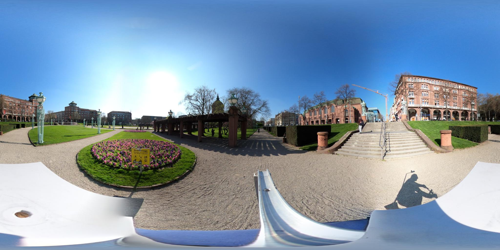

<p align="center">
  
</p>

# SilverWays SVI


Run deep learning models on Street View Imagery (SVI) and save predictions, masks, metrics, and visualizations.

The project supports separate CPU and GPU Conda environments.

## What this repo does

This repository is for running inference on existing SVI images.

Current supported workflows:

- Generate directional crops from panorama images
- Run PSPNet semantic segmentation
- Run YOLO object detection, for example bench detection
- Run Mask2Former semantic segmentation using the Mapillary Vistas model
- Run Grounded-SAM: Grounding DINO text-prompt detection + SAM2 segmentation

## Repository structure

```text
environment-cpu.yaml          Conda environment for CPU users
environment-gpu.yaml          Conda environment for GPU users
pyproject.toml                Python package setup
conf/models/*.yaml            Model-specific runtime configs
src/silverways_svi/           Main inference Python package
data/pano/                    Input panorama images for testing
data/crop/                    Generated image crops, not committed
models/                       Downloaded model weights, not committed
outputs/                      Prediction outputs, not committed
```
## Setup
Install either Conda or Mamba first.

Mamba is recommended because it is faster for solving Conda environments, but regular Conda also works. Mamba is compatible with most Conda commands, so the commands below can usually be swapped one-for-one. See the official Mamba installation docs: https://mamba.readthedocs.io/en/latest/installation/mamba-installation.html

1. Clone the repository:

```bash
git clone https://github.com/solo2307/silverways-svi.git 
```
2. Create a Conda environment:
For CPU users:
```bash 
conda env create -f environment-cpu.yaml
conda activate silverways-cpu 
``` 
For GPU users: 
```bash
mamba env create -f environment-gpu.yaml
conda activate silverways-gpu
```

3. For CLI commands
```bash 
python pip isntall -e . --no-deps 
```

## CLI usage notes
```bash 
silverways --help
```

Download models:
```bash
silverways download pspnet
silverways download all 
```
Crop panorama images:
```bash
silverways generate-pano-crops \
  --input-dir data/pano \
  --output-dir data/crop \
  --headings 0,90,180,270 \
  --fov-degrees 90 \
  --trim-top-ratio 0.08 \
  --trim-bottom-ratio 0.15
```
All user-facing commands use hyphens, not underscores.

Run inference on crops:

```bash
silverways run-pspnet --config conf/models/pspnet.yaml
silverways run-yolo --config conf/models/yolo.yaml
silverways run-mask2former --config conf/models/mask2former_mapillary.yaml
silverways run-grounded-sam --config conf/models/grounded_sam.yaml
```

## Config YAML files

Each model is controlled by a YAML file in:

```text
conf/models/
```

These files define:
- input_dir       where input images come from
- output_dir      where outputs are saved
- recursive       whether to search inside subfolders
-limit           how many images to process; use 1 for testing
- device          cpu, cuda, or auto
- model           model weights / model name  local directory
- outputs         which output files to save

Example:
```yaml
input_dir: data/crop
output_dir: outputs/yolo
recursive: false
limit: 1
device: auto

model:
  weights: models/yolo11l.pt

predict:
  conf: 0.35
  iou: 0.60
  imgsz: 640
  target_classes:
    - bench

outputs:
  save_annotated: true
  save_json: true
  save_txt: false
```

`limit: 1` for a quick trest run,
`device: cpu` to force CPU inference, 
`device: cuda` to force GPU inference, or `device: auto` to automatically use GPU if available.
